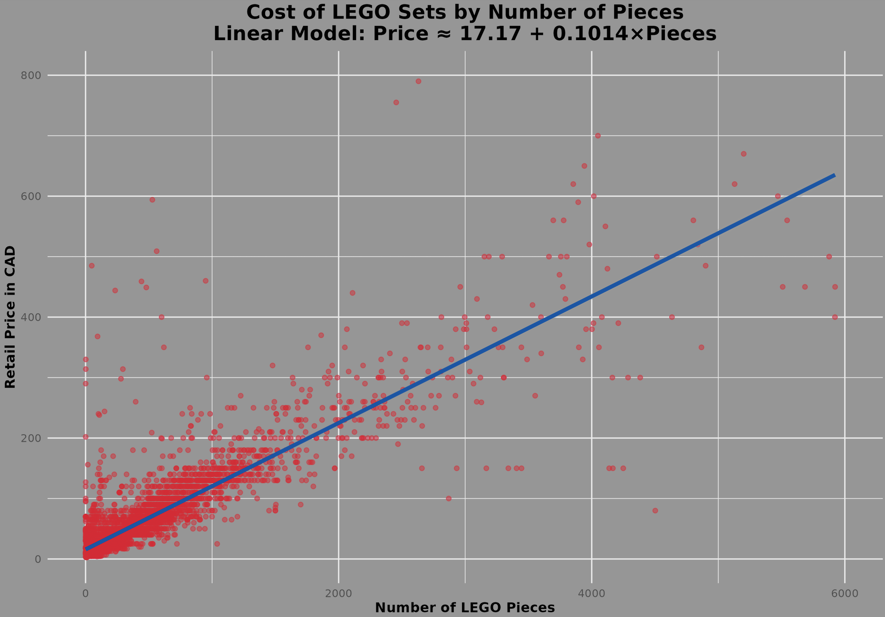

## 📊 LEGO Set Pricing Analysis in R

This script uses the [`brickset`](https://cran.r-project.org/web/packages/brickset/index.html) R package to analyze how the **number of pieces** in a LEGO set relates to its **Canadian retail price**, by fitting a linear regression model.

> **Data Source**: [Brickset.com](https://brickset.com) — comprehensive LEGO set guide (1970–2024 data).

---

### 🔧 Setup
#### The `'brickset'` package includes a built-in dataset called `'legosets'`
```r
# Install and load the required package

install.packages("brickset")
data("legosets")
```

---

### 🧹Filtering 
```r
# 🧾 Note:
# - The column for Canadian retail price is named 'CA_retailPrice' in the dataset.
# - You can view all available column names using: colnames(legosets)
# - Removing sets with missing or zero values for pieces and price.

lego_analysis_data <- subset(legosets, !is.na(CA_retailPrice) & CA_retailPrice > 0 & pieces > 0 & year >= 2000)
```

---

### 📈 Linear Regression Plot
```r
library(ggplot2)

# Create regression plot
plot <- ggplot(lego_analysis_data, aes(x = pieces, y = CA_retailPrice)) +
  geom_point(alpha = 0.5, color = "#E4002B") +  # LEGO red points
  geom_smooth(method = "lm", se = TRUE, color = "#0055A9", linewidth = 1.5) +  # LEGO blue regression line
  labs(
    title = "Cost of LEGO Sets by Number of Pieces\nLinear Model: Price ≈ 17.17 + 0.1014×Pieces",
    x = "Number of LEGO Pieces",
    y = "Retail Price in CAD"
  ) +
  theme_minimal() +
  theme(
    plot.title = element_text(face = "bold", size = 16, hjust = 0.5),
    axis.title = element_text(face = "bold")
  ) +
  xlim(0, 6000) +
  ylim(0, 800)

print(plot)
```


---

### 📉 Linear Model Summary
```r
# Fitting linear regression: price ~ number of pieces
lm_model <- lm(CA_retailPrice ~ pieces, data = lego_analysis_data)

# View coefficients
coef(lm_model)

# Full model summary
summary(lm_model)
```

    lm(formula = CA_retailPrice ~ pieces, data = lego_analysis_data)

    Coefficients:
    --------------
    (Intercept)     : 17.1694
    pieces          : 0.1014

---

📌 Interpretation
The regression model suggests the following:

- Estimated Price ≈ 17.17 + 0.1014 × Pieces
- The intercept of ~$17.17 CAD suggests a base cost (e.g. branding, packaging, etc.).
- Each additional piece adds approximately $0.10 CAD to the price.

-> This supports the intuitive idea that larger sets tend to be more expensive.

❗❗❗ This is a basic linear model that does not account for other factors.
Future improvements may involve multiple regression models using more predictors (e.g., year, theme, minifigures).
